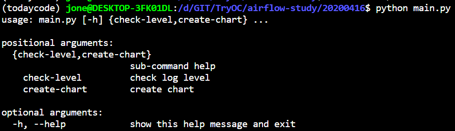
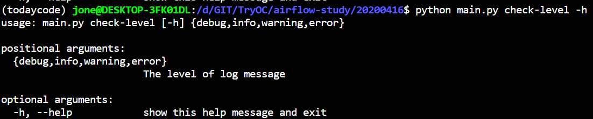
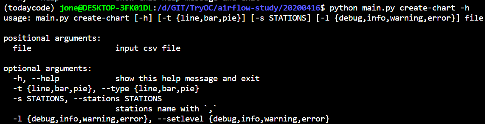

## CLI 인터페이스 구현하기 (Airflow 1.0.1 참조)

### 로그 세팅하기

- utils.py 의 TODO 구현하기

- 로그 레벨 (DEBUG, INFO, WARNING, ERROR) 수준 이해하기

- 핸들러 (StreamHandler, FileHandler) 추가하는 코드 작성

- 로그 포맷 설정 하는 코드 작성

  - 포맷 예제

  ```bash
  2020-04-12 04:37:40,283 - root - DEBUG - checking level
  ```

- 참조 링크
  - https://realpython.com/python-logging/


### CLI 인터페이스 연동

- cli.py의 TODO 구현하기
- Subparser 메서드 적용시키기
  - Airflow 1.0.1 - bin/cli.py 파일 참조
- 각 커맨드에 매칭되는 함수 적용 시키기


### main.py CLI 인터페이스

- 진입점

  

- check-level 서브 커맨드

  

- create-chart 서브 커맨드

  

